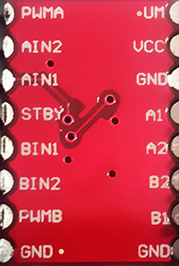

## 电机驱动

使用模块: TB6612fng. 

#### 模块图片



#### 引脚说明

| 引脚名  | 说明           |      | 引脚名  | 说明                  |
| ---- | ------------ | ---- | ---- | ------------------- |
| PWMA | A控制信号输入      |      | VM   | 电机驱动电压输入端（4.5V-15V） |
| AIN2 | A电机输入端2      |      | VCC  | 逻辑电平输入端（2.7V-5.5V）  |
| AIN1 | A电机输入端1      |      | GND  | 接地                  |
| STBY | 正常工作/待机状态控制端 |      | AO1  | A电机输出端1             |
| BIN1 | B电机输入端1      |      | AO2  | A电机输出端2             |
| BIN2 | B电机输入端2      |      | BO2  | B电机输出端2             |
| PWMB | B控制信号输入端     |      | BO1  | B电机输出端1             |
| GND  | 接地           |      | GND  | 接地                  |

#### 逻辑表

| IN1  | IN2  | PWM  | STBY |      | O1   | O2   | status        |
| ---- | ---- | ---- | ---- | ---- | ---- | ---- | ------------- |
| H    | H    | H/L  | H    |      | L    | L    | Break         |
| L    | H    | H    | H    |      | L    | H    | spin forword  |
| L    | H    | L    | H    |      | L    | L    | Break         |
| H    | L    | H    | H    |      | H    | L    | Spin Backword |
| H    | L    | L    | H    |      | L    | L    | Break         |
| L    | L    | H    | H    |      | OFF  | OFF  | Stop          |
| H/L  | H/L  | H/L  | L    |      | OFF  | OFF  | Sleep         |


#### 接线方式


#### Code Exmple

```c++

//motor A connected between A01 and A02
//motor B connected between B01 and B02

int STBY = 10; //standby

//Motor A
int PWMA = 3; //Speed control
int AIN1 = 9; //Direction
int AIN2 = 8; //Direction

//Motor B
int PWMB = 5; //Speed control
int BIN1 = 11; //Direction
int BIN2 = 12; //Direction

void setup(){
  pinMode(STBY, OUTPUT);

  pinMode(PWMA, OUTPUT);
  pinMode(AIN1, OUTPUT);
  pinMode(AIN2, OUTPUT);

  pinMode(PWMB, OUTPUT);
  pinMode(BIN1, OUTPUT);
  pinMode(BIN2, OUTPUT);
}

void loop(){
  move(1, 255, 1); //motor 1, full speed, left
  move(2, 255, 1); //motor 2, full speed, left

  delay(1000); //go for 1 second
  stop(); //stop
  delay(250); //hold for 250ms until move again

  move(1, 128, 0); //motor 1, half speed, right
  move(2, 128, 0); //motor 2, half speed, right

  delay(1000);
  stop();
  delay(250);
}

void move(int motor, int speed, int direction){
  //Move specific motor at speed and direction
  //motor: 0 for B 1 for A
  //speed: 0 is off, and 255 is full speed
  //direction: 0 clockwise, 1 counter-clockwise

  digitalWrite(STBY, HIGH); //disable standby

  boolean inPin1 = LOW;
  boolean inPin2 = HIGH;

  if(direction == 1){
    inPin1 = HIGH;
    inPin2 = LOW;
  }

  if(motor == 1){
    digitalWrite(AIN1, inPin1);
    digitalWrite(AIN2, inPin2);
    analogWrite(PWMA, speed);
  }else{
    digitalWrite(BIN1, inPin1);
    digitalWrite(BIN2, inPin2);
    analogWrite(PWMB, speed);
  }
}

void stop(){
  //enable standby
  digitalWrite(STBY, LOW);
}
```


## 参考链接

[此文档参考](http://bildr.org/2012/04/tb6612fng-arduino/)

[用晶体管控制电机](http://bildr.org/2012/03/rfp30n06le-arduino/)